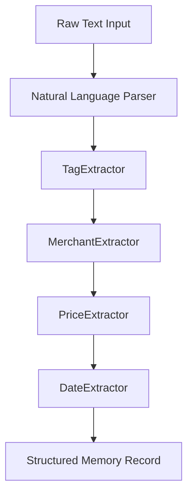

# Architecture Documentation — ReBuy Memory Engine

ReBuy is engineered to act as a zero-latency, client-side **Personal Memory Engine**. To support a 10-year maintenance lifecycle, the software avoids server-side dependencies and relies strictly on standard web platform APIs.

---

## 🏗️ Core Architectural Design Decisions

### 1. Client-Side Only (Static Hosting)
- **Decision**: Zero server-side runtime (no Node/Express backend, no Supabase, no Firebase).
- **Rationale**: Web apps with backends introduce server maintenance costs, network latency, api breaking changes, and privacy concerns. By writing ReBuy as pure client-side code running on GitHub Pages, we guarantee near-zero cost, immediate load speeds, and lifetime persistence.
- **Privacy Policy**: All data remains locally in the user's browser sandbox, making it private by design.

### 2. Custom Offline Storage (IndexedDB Repository Pattern)
- **Decision**: Implement a native, type-safe Promise-based wrapper around IndexedDB (`src/database/db.ts`) instead of a heavy ORM (like Dexie or RxDB).
- **Rationale**: Keeps bundle sizes low. It avoids external dependency churn and provides direct control over indexes and database upgrade handlers.

### 3. Natural Language Processing (Tokenization Pipeline)
- **Decision**: Use a regex-based pipeline architecture (`src/parser/nlp.ts`) rather than shipping bulky machine learning models (like Transformers.js) or relying on external API calls (OpenAI/ChatGPT).
- **Rationale**: "Capture in less than 3 seconds" requires instant load and parser feedback. Regex tokenizers process queries in less than 1ms, whereas model loads take seconds and consume hundreds of megabytes of memory. The Pipeline pattern allows developers to register new extractors cleanly.

### 4. Fuzzy Search and Scoring Matrix
- **Decision**: Direct token matching with weighted relevancy scores and recency multi-boosts (`src/search/engine.ts`).
- **Rationale**: Simple text matches don't prioritize relevant entries. Our custom scorer ranks exact hits higher and gives newer records a decay multiplier, keeping results intuitive.

---

## 📂 Modular Folder Blueprint

To keep changes segregated, folders represent distinct domains:

- `src/components/`: Pure visual presentation layer.
- `src/database/`: Data layer, schema initialization, and transactional reads/writes.
- `src/parser/`: Data structuring and processing logic.
- `src/search/`: Searching, indexing, scoring calculations.
- `src/features/`: Component aggregations mapping to screen views (Capture, Search Stream, Details).
- `src/styles/`: Style sheets separating layout configuration from visual themes.
